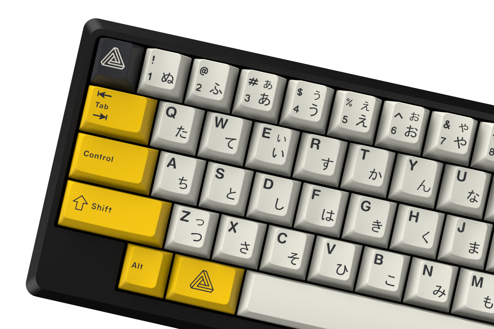
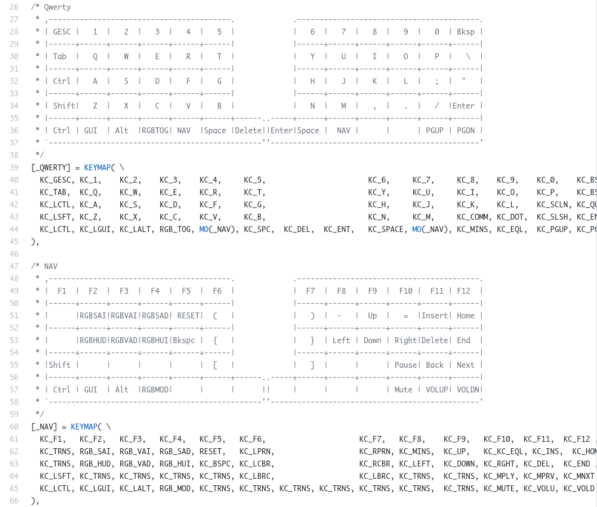
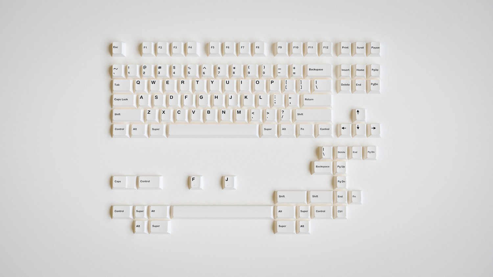
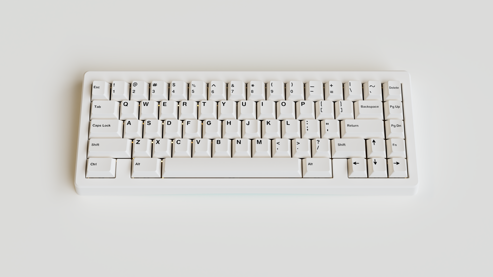

## Custom mechanical keyboards

*https://github.com/lazystring/mechanicalkeyboards*

---

##### A guide to going broke

---

##### What is a mechanical keyboard?

> A mechanical keyboard is a keyboard built with high quality, typically spring activated, key switches.

\- *mechanicalkeyboards.com*

---

##### How do I get one?

---

##### Popular electronic manufacturers

Typically cost around $20-200

> Razer, Corsair, SteelSeries, Logitech, ...

---

##### Build your own custom keyboard

You gather the parts, you do the soldering.

Typically costs around $200-1,000

---

---

##### Why would you pay so much?

* Premium materials and quality design (not mass-produced).
* *You* fully control the way your keyboard looks and feels.
* Custom keyboards are often fully programmable.
* Countless options.

---

##### No really, why would you pay so much?

The keyboard is a tool we use daily, much like an artist's brush or a musician's instrument. You want a keyboard that *feels* good. One that you look forward to typing on each day, for several hours. One that fits your style and enables you to reach your maximum efficiency.

---

##### Reality...

---

##### I'm convinced, so what are my options?

---

##### 30% keyboards

For the ultra-minimalists.

---

##### 40% keyboards

For the minimalists.

---

##### 60% keyboards

For the efficient.

---

##### 60% HHKB keyboards

For the hackers?

---

##### 65% keyboards

For the arrow keys.

> 67 and 68 key variants

---

##### 65% (with macro pad) keyboards

For the show-offs.

---

##### 75% keyboards

For people who like to reach for their keys.

---

##### TKL (ten-keyless) keyboards

For the cautious.

---

##### Full keyboards

Ok, you really don't need that many keys.

---

##### Southpaw keyboards

---

##### Split keyboards

---

##### Ortholinear keyboards

---

##### Climbing keyboards?

---

##### WTF keyboards

---

##### How to build a keyboard

---

##### Equipment

* A good soldering iron with good solder.
* Solder wick or solder sucker.
* A screwdriver.

---

##### The PCB

* More switches than there are inputs to the microcontroller.
    - Solution: Keyboard matrix
    - N*M keys map to (N+M) pins
* Circuit components
    - Diodes: limit the direction of currents
    - Resistors: Current -> Voltage
* Made to support multiple phsyical layouts.
* Hotswappable options.

*Manufactured PCBs usually come fully assembled.*

Note:
A key concept in keyboard PCB design is the "keyboard matrix". That basic problem
is that we wish to know the state of the keyboard at any given time. Forming a matrix
of columns which connect to a set of N pins and rows that connect to a set of M pins
allow us to capture the state of N*M keys with only N+M inputs.

AVR processors are most commonly found in keyboards. They are 8-bit microcontrollers
that are designed to be easy to work with.

---

---

##### The firmware

* Open-source: TMK, QMK
* Fully configurable
* Create your own key mappings

Note:
TMK is a keyboard firmware library. QMK is a very popualar, community-maintained
fork of TMK, with some useful features for Atmel AVR and ARM controllers.

Each keyboard project can be added with its own keymap to be built. These are highly customizable
and allow you to specify several different layers of customized key mappings.

Here's a very basic diagrom of how the firmware works.

The project currently has support for over 200 keyboards.

Whenever you press a key, the firmware of your keyboard registers this event. It
registers an event when the key is pressed, held, and released. This is usually captured during
a periodic scan of the keyboard matrix.

The HID specification describes what a keyboard can actually send through USB to a connected
device. This includes a pre-defined list of scancodes which are simple numbers from 0x00 to 0xE7 (231).

Once the keycode reaches the operating system, a piece of software has to match it to an actual character.

In the case of Unix, the standard graphical user interface is the X Window System. The X server sits
between the operating system kernal and user-space applications.

When a hardware event occurs, the CPU triggers an interrupt. The corresponding interrupt handler detects
if the event is a key press or release and records the scancode which identifies the key.

The X server reads input events through a device file, and with a table that it maintains, translates the
keycode into key symbols. One of the mechanisms to modify this table is xmodmap. I personally use this to
map my Caps Lock key to Control on any keyboard (because nobody uses Caps Lock)

For text-mode applications, such as a text editor running in a terminal emulator, there is an interface
interface called a pseudo-terminal, abbreviated "pty", a virutal character device which transmits bytes.
It's a bidirectional communication channel. Input is written to the "master" end of the connection and a
process sits at the "slave" end to receive the input. When a terminal emulator receives a keypress, it
translates it into one or more bytes which the application can read from the pty device.

---

Note:
Here's an example keymap which I set up for the Zen keyboard. My goal here was to try to move
the most commonly used "programming" keys closer to the home row. It's still a work in progress.

---

##### The case

Many different materials

* High profile vs. low profile
* Aluminum
* Wood
* Plastic
* Polycarbonate (durable plastic)
* Brass-weighted

---

##### The plate

* Same materials as the case
* Must support whatever physical layout you plan to use.
    * Split spacebars (e.g. 2.25U + 1.25U + 2.75U)

---

##### The switches

* Clicky or silenced, tactile or linear (smooth).
* *Hundreds* of options
    - ZealPC (Healios, Tealios, Zealios, Zilents)
    - Cherry MX (Browns, Blues, Reds, Blacks, etc.)
    - Kailh BOX (White, Brown, Red, Black)
* Come with different spring weights

Note:
There are many different types of switches which can often be categorized
into the groups linear, tactile, and clicky. Linear switches have no bump
when pressed and are a very smooth experience. Tactile switches, on the contrary,
have this bump which adds a little bit of resistance and tactility when pressing
each key. Clicky switches are for those looking to *sound* more productive.

It's also pretty common to apply some sort of lubricant to switches to add
to the smoothness and reduce switch "ping", a residual ringing sound heard
after a keyswitch with metal springs inside has been struck.

Krytox 205 Grade 0 being a popular, and hard to find option. It's a semifluid
grease obtained keyboard enthusiasts with the help of the chemical company
Miller-Stephenson. In general, there is thin and thick lube. Thin being great
for tactile switches, and thick for linear switches.

---

##### The keycaps

* Standard, mass-produced keycaps
   - Very affordable
* Custom, independently designed keycaps
   - Cost more than an entire keyboard
   - Limited, typically sold in group buys

---

---

---

##### Keycap materials and profiles

* People really care about their keycaps
* Materials: ABS, PBT, POM, PVC
* Profiles: Cherry, SA, DSA, etc.

Note:
Most keyboards in the world have keycaps made of ABS. It's short for three words
I can't pronounce. ABS is the preferred plastic for double-shot moudling since
most other plastics will shrink too much during the process. The legends on ABS
keycaps can also be pad-printed, laser-etched, or laser-engraved.

PBT is one of the hardest, most durable materials for keycaps, but is difficult
to mold and thus, more uncommon.

Due to the aforementioned shrinking, legends on these keycaps are very rarely
double-shot moulded.

---

##### Doubleshot keycaps

No need for "printing" the legends.

---

##### Artisan keycaps

* Independently crafted, hand-painted keycaps
* Sold in raffles or group buys
* The rarity of these caps make them high valued
* Can go from $50 to $200 per keycap.
* Interested in getting some? (r/mechmarket)

---

##### How does one acquire these parts?

---

##### An online retailer

* Most notably, KBDFans.cn
* The most affordable option, great for entry-level enthusiasts
* Parts are still great quality
* Less options

---

##### Individual group buys

* By far, the most expensive
* Sold as entire DIY kits (case, plate, PCB)
* Run by individuals on online forums
* Extremely high quality, tons of variety

---

##### How a group buy works

* The seller designs their keyboard / keycaps
* Produces digital renders and posts to the forum to gather potential buyers
* When MOQ is met, seller contacts the manufacturer to schedule a production run
* Seller posts to the forum, starts accepting orders for the group buy (typically, a week)
* Final product is shipped to buyers several months later

---

##### Group buy partners

---

##### Let's build a keyboard

---

##### Let's build an affordable keyboard

---

##### Let's build an "affordable" keyboard

---

##### Identify our requirements

* 65% keyboard
* GMK keycaps (German manufactured, doubleshot ABS, cherry profile)
* Aluminum case and plate
* Linear switches (smooth)

---

##### 65% Tada68 PCB

Comes with plate and stabilizers:

**Price**: $52

---

##### TOFU 65% Aluminum Case

**Price**: $109

---

##### 70x Tealios Linear Switches

**Price**: $70

---

##### GMK Minimal by clavier.xyz

**Price**: $110

---

##### Not bad

**Total**: $341

---

#### Typing sounds

---

#### Thank you.

#### Questions?
